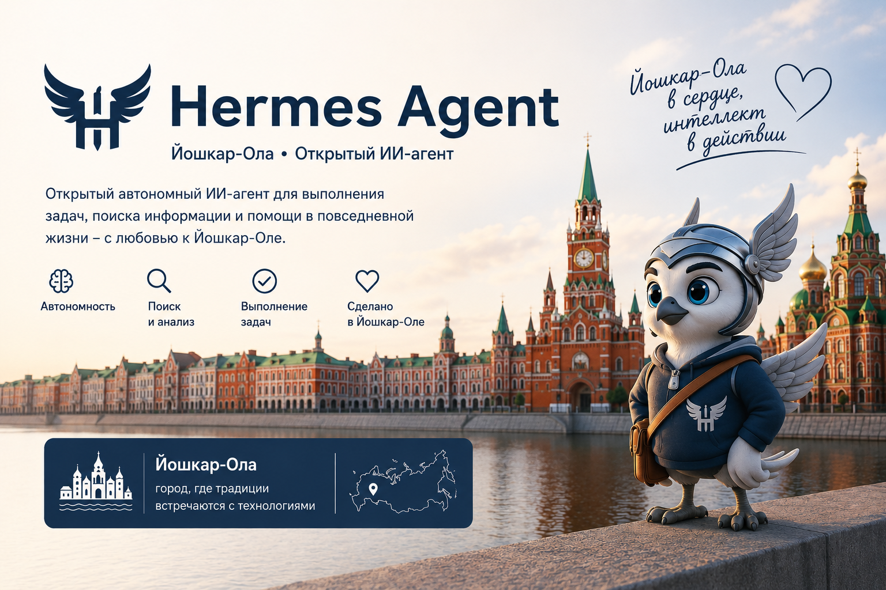

<p align="center">
  
</p>

<p align="center">
  <a href="https://pypi.org/project/iola-hermes/"></a>
  <a href="https://www.npmjs.com/package/iola-hermes"></a>
  <a href="https://github.com/yasg1988/iola-hermes/releases"></a>
  <a href="https://pypi.org/project/iola-hermes/"></a>
  <a href="https://github.com/yasg1988/iola-hermes/blob/main/LICENSE"></a>
  <a href="https://github.com/yasg1988/iola-hermes/actions/workflows/tests.yml"></a>
  <a href="https://github.com/yasg1988/iola-hermes/actions/workflows/lint.yml"></a>
  <a href="https://github.com/yasg1988/iola-hermes/actions/workflows/typecheck.yml"></a>
  <a href="https://github.com/yasg1988/iola-hermes/actions/workflows/desktop-release.yml"></a>
  <a href="https://github.com/yasg1988/iola-hermes/actions/workflows/tauri-desktop-release.yml"></a>
  <a href="https://github.com/yasg1988/iola-hermes/actions/workflows/docker-publish.yml"></a>
  <a href="https://github.com/yasg1988/iola-hermes/actions/workflows/deploy-site.yml"></a>
  <a href="https://github.com/yasg1988/iola-hermes/actions/workflows/osv-scanner.yml"></a>
  <a href="https://github.com/yasg1988/iola-hermes/actions/workflows/supply-chain-audit.yml"></a>
  <a href="https://www.npmjs.com/package/iola-hermes"></a>
  <a href="https://pypi.org/project/iola-hermes/"></a>
  <a href="https://github.com/yasg1988/iola-hermes/stargazers"></a>
  <a href="https://github.com/yasg1988/iola-hermes/forks"></a>
  <a href="https://github.com/yasg1988/iola-hermes/watchers"></a>
  <a href="https://github.com/yasg1988/iola-hermes/issues"></a>
  <a href="https://github.com/yasg1988/iola-hermes/pulls"></a>
  <a href="https://github.com/yasg1988/iola-hermes/commits/main"></a>
  
  
  
</p>

# Hermes RU Iola

**Hermes RU Iola** — русскоязычный публичный форк
[NousResearch/Hermes Agent](https://github.com/NousResearch/hermes-agent).
Проект адаптирует Hermes Agent для русскоязычных пользователей, развивает
установку через npm, desktop-сборки для Windows/Linux, русскую локализацию,
дополнительных провайдеров моделей и интеграции с мессенджерами.

Проект не связан с Nous Research, не поддерживается ими и не является
официальной сборкой Hermes Agent. Оригинальный проект доступен в репозитории
[nousresearch/hermes-agent](https://github.com/NousResearch/hermes-agent).
Лицензия MIT и уведомления об авторских правах upstream сохранены.

## Статус проекта

Проект находится в активной адаптации под русскоязычную аудиторию. Уже
подготовлены npm-установка, русская локализация основных интерфейсов,
брендинг **Hermes RU Iola**, поддержка YandexGPT и GigaChat, а также базовая
инфраструктура для будущих провайдеров моделей и мессенджеров.

## Установка через npm

```bash
npm install -g iola-hermes
iola-hermes
```

npm-пакет устанавливает Python backend из PyPI той же версии:

```text
iola-hermes
```

Команда `iola-hermes` запускает Hermes CLI через Python-модуль
`hermes_cli.main`. Команда `hermes` также остаётся доступной при установке
через Python packaging для совместимости с upstream.

## Установка из исходников

```bash
git clone https://github.com/yasg1988/iola-hermes.git
cd iola-hermes
py -3.14 -m pip install -e . --no-deps
iola-hermes
```

Проект требует Python `>=3.11,<3.15`. На Windows поддерживаются Python
3.11, 3.12, 3.13 и 3.14.

Для нативной установки на Windows используйте PowerShell-скрипт
`scripts/install.ps1`.

## Desktop

Desktop-приложение основано на Electron-сборке upstream Hermes. Имя приложения,
идентификаторы релиза и ссылки обновления переведены на **Hermes RU Iola**.

Планируемые форматы сборок:

- Windows: `nsis`, `msi`
- Linux: `AppImage`, `deb`, `rpm`

Скрипты сборки находятся в `apps/desktop/package.json`.

Дополнительно в `apps/desktop-tauri` есть легкое Tauri-приложение на Rust и
системном WebView. Оно собирает основной React-интерфейс desktop, запускает
локальный backend через Tauri-мост, поддерживает gateway-подключения,
обновления, уведомления, deep links и отдельные окна сессий. Проверка:
`npm run tauri:check`. Сборка Tauri-артефактов Windows/Linux настроена в
workflow `tauri-desktop-release.yml`.

## Русификация

Русский язык включён как основной для пользовательского опыта форка. Перевод
охватывает CLI, web/desktop-интерфейсы, TUI, установочные сценарии и
документацию проекта.

Названия внешних сервисов и провайдеров, например OpenAI, Nous Research,
Slack, Discord, Matrix и Telegram, сохраняются без перевода.

## Провайдеры моделей

Hermes RU Iola использует plugin-подход upstream. Для простых
OpenAI-compatible провайдеров не нужно менять ядро проекта: достаточно
добавить provider plugin.

В форке уже добавлены провайдеры:

- **YandexGPT** — нужен `YANDEX_API_KEY` и `YANDEX_FOLDER_ID`; endpoint по
  умолчанию: `https://ai.api.cloud.yandex.net/v1`.
- **GigaChat** — нужен готовый `GIGACHAT_AUTH_KEY` или пара
  `GIGACHAT_CLIENT_ID` + `GIGACHAT_CLIENT_SECRET`; дополнительно можно выбрать
  `GIGACHAT_SCOPE` (`GIGACHAT_API_PERS`, `GIGACHAT_API_B2B` или
  `GIGACHAT_API_CORP`). Hermes RU Iola автоматически получает короткоживущий
  access token для OpenAI-compatible endpoint
  `https://gigachat.devices.sberbank.ru/api/v1`.

Оба провайдера отображаются в начале списка выбора модели. Настроить их можно
через мастер `iola-hermes setup` или `iola-hermes model`.

Документы:

- `docs/iola-provider-roadmap.md`
- `docs/templates/model-provider-plugin/`

## Мессенджеры

Интеграции с мессенджерами развиваются через gateway adapters и plugin path.
Сначала сохраняется совместимость с upstream-платформами, затем добавляются
новые адаптеры и русские инструкции настройки.

## Планы

- Дособрать Windows/Linux desktop-релизы и проверить установщики на чистых
  машинах.
- Расширять набор OpenAI-compatible провайдеров через plugin-шаблон.
- Расширить русские инструкции для Telegram, Matrix, Discord, Slack и других
  gateway-интеграций.
- Поддерживать синхронизацию с upstream без потери русской локализации.

## Лицензия

Проект распространяется по лицензии MIT. См. `LICENSE`.
